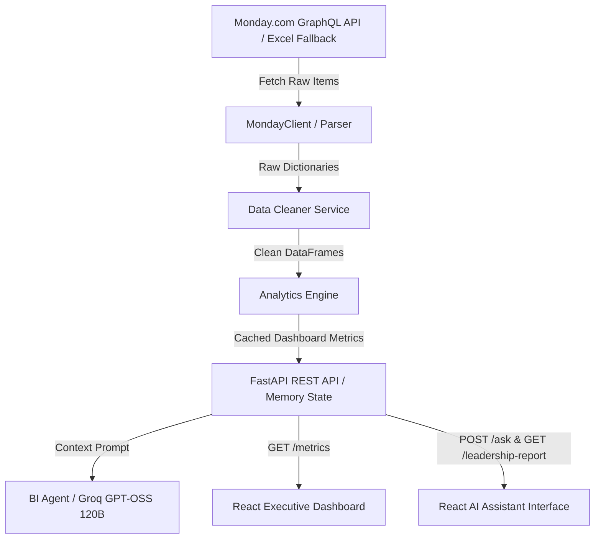

# Monday.com Business Intelligence Agent

An end-to-end, production-ready **Executive Business Intelligence (BI) Platform & AI Strategy Advisor** powered by **Monday.com GraphQL v2 API**, **FastAPI**, **Pandas**, **Recharts**, and the **Groq API** via the official OpenAI-compatible Python client (`openai`).

---

## 🌟 Key Features

- **Automated Data Pipeline**: Seamlessly fetches, paginates, cleans, and standardizes Monday.com board data (Deals Funnel & Work Orders Tracker) with zero manual intervention.
- **Deterministic Analytics Engine**: Pre-computes all business KPIs (Pipeline Value, Sector Breakdown, Sales Stage Velocity, Billing Realization %, Work Order Fulfillment, Top Customers) in-memory without side-effects.
- **AI Strategy Advisor**: Natural language Q&A and Executive Leadership Report generation powered by Groq (`openai/gpt-oss-120b`), grounded strictly in pre-computed metrics.
- **Interactive Executive Dashboard**: Dynamic dark-mode analytics dashboard built with React and Recharts, featuring responsive charts, KPI cards, and live backend connection indicators.
- **Data Quality Audit**: Automatic data quality report generation and caveat tracking for 100% analytical transparency.

---

## 🏗️ Architecture Overview



---

## 🛠️ Technology Stack

| Layer | Technology | Description |
| --- | --- | --- |
| **Backend Framework** | Python 3.12, FastAPI, Uvicorn | High-performance asynchronous REST API service |
| **Data Processing** | Pandas, OpenPyXL | Data cleaning, type normalization, and KPI calculations |
| **AI Integration** | OpenAI Python client (`openai`) configured for Groq | `openai/gpt-oss-120b` for strategic advice and report generation |
| **Frontend Framework** | React 18, Vite | Modular component architecture with fast HMR |
| **Styling & Icons** | Tailwind CSS, Lucide React | Modern executive dark-mode UI with dynamic badges |
| **Data Visualization**| Recharts | Responsive bar, donut, and line charts |
| **Testing** | Pytest, FastAPI TestClient | Comprehensive unit & integration testing |

---

## 📂 Project Structure

```text
Skylarp-drones-Software-Building-/
├── backend/
│   ├── api/
│   │   └── routes.py              # FastAPI APIRouter endpoint handlers
│   ├── models/
│   │   └── schemas.py             # Pydantic request & response schemas
│   ├── services/
│   │   ├── monday_service.py      # Monday.com GraphQL v2 client & pagination
│   │   ├── data_cleaner.py        # Data cleaning, normalization, & quality report
│   │   ├── analytics_engine.py    # Business KPI calculations (deterministic)
│   │   └── bi_agent.py            # Groq LLM integration & report generation
│   ├── tests/
│   │   ├── test_data_cleaner.py
│   │   ├── test_analytics_engine.py
│   │   ├── test_bi_agent.py
│   │   └── test_api.py            # FastAPI TestClient test suite
│   ├── main.py                    # FastAPI app entry point, CORS, lifespan caching
│   ├── render.yaml                # Render deployment configuration
│   ├── requirements.txt           # Backend dependencies
│   └── .env.example               # Environment template
├── frontend/
│   ├── src/
│   │   ├── api/
│   │   │   └── api.js             # Centralized fetch API client
│   │   ├── components/
│   │   │   ├── dashboard/         # Executive Dashboard UI components
│   │   │   │   ├── Dashboard.jsx
│   │   │   │   ├── KPICards.jsx
│   │   │   │   ├── RevenueBySectorChart.jsx
│   │   │   │   ├── RevenueByStageChart.jsx
│   │   │   │   ├── MonthlyPipelineChart.jsx
│   │   │   │   ├── TopCustomersTable.jsx
│   │   │   │   ├── BillingSummaryCard.jsx
│   │   │   │   └── WorkOrderCard.jsx
│   │   │   ├── Header.jsx
│   │   │   ├── LeadershipButton.jsx
│   │   │   ├── ChatWindow.jsx
│   │   │   ├── ChatMessage.jsx
│   │   │   ├── DataQualityBadge.jsx
│   │   │   └── ChatInput.jsx
│   │   ├── hooks/
│   │   │   └── useDashboard.js    # Custom dashboard data hook
│   │   ├── App.jsx                # Main application layout & state
│   │   └── main.jsx
│   ├── vercel.json                # Vercel deployment configuration
│   ├── package.json
│   └── .env.example
├── .env.example
├── UPDATES.md                     # Project task log
└── README.md
```

---

## ⚙️ Environment Variables

### Backend Configuration (`backend/.env`)

```env
GROQ_API_KEY=your_groq_api_key_here
GROQ_MODEL=openai/gpt-oss-120b
MONDAY_API_KEY=your_monday_api_key_here
MONDAY_BOARD_ID=your_monday_board_id_here
DEALS_BOARD_ID=your_deals_board_id_here
WORK_ORDERS_BOARD_ID=your_work_orders_board_id_here
```

### Frontend Configuration (`frontend/.env`)

```env
VITE_API_URL=http://localhost:8000
```

---

## 🚀 Running Locally

### 1. Backend Setup

```bash
# Navigate to backend directory
cd backend

# Create virtual environment (Python 3.12 recommended)
python -m venv venv

# Activate virtual environment
# Windows PowerShell:
.\venv\Scripts\Activate.ps1
# Linux/macOS:
source venv/bin/activate

# Install backend dependencies
pip install -r requirements.txt

# Run FastAPI dev server (defaults to http://localhost:8000)
uvicorn main:app --reload --port 8000
```

### 2. Frontend Setup

```bash
# Navigate to frontend directory
cd frontend

# Install node packages
npm install

# Start Vite dev server (defaults to http://localhost:5173)
npm run dev
```

---

## 🧪 Running Tests

```bash
# Run unit & API integration tests
.\backend\venv\Scripts\python.exe backend/tests/test_api.py
.\backend\venv\Scripts\python.exe backend/tests/test_analytics_engine.py
.\backend\venv\Scripts\python.exe backend/tests/test_data_cleaner.py
.\backend\venv\Scripts\python.exe backend/tests/test_bi_agent.py
```

---

## 📡 API Documentation

Access the interactive OpenAPI Swagger documentation at: `http://localhost:8000/docs`

| Endpoint | Method | Description |
| --- | --- | --- |
| `/` | `GET` | API root welcome message |
| `/health` | `GET` | Health check endpoint (`{"status": "healthy"}`) |
| `/metrics` | `GET` | Returns pre-computed cached business dashboard metrics |
| `/ask` | `POST` | Asks strategic business questions to the AI BI Agent |
| `/leadership-report` | `GET` | Generates a Markdown executive leadership report |

---

## 🌐 Production Deployment Guide

### Deploying Backend on Render

1. Connect your GitHub repository to [Render](https://render.com).
2. Create a new **Web Service** selecting the repository.
3. Use `backend/render.yaml` configuration or set manually:
   - **Environment**: Python 3.12
   - **Build Command**: `pip install -r requirements.txt`
   - **Start Command**: `uvicorn main:app --host 0.0.0.0 --port $PORT`
4. Add Environment Variables on Render dashboard (`GROQ_API_KEY`, `MONDAY_API_KEY`, `DEALS_BOARD_ID`, `WORK_ORDERS_BOARD_ID`). `GROQ_MODEL` is optional and defaults to `openai/gpt-oss-120b`.

### Deploying Frontend on Vercel

1. Import your GitHub repository to [Vercel](https://vercel.com).
2. Set **Root Directory** to `frontend`.
3. Set **Framework Preset** to `Vite`.
4. Add Environment Variable:
   - `VITE_API_URL` = `https://your-backend-service.onrender.com`
5. Click **Deploy**.

---

## 🔮 Future Improvements

- [ ] Webhook integration for real-time Monday.com board update triggers.
- [ ] Export executive reports directly to PDF format.
- [ ] Historical trend snapshot comparison over multi-year periods.
- [ ] User role-based access control (RBAC) for executive views.

---
*Maintained by Skylark Drones Software Engineering Team*
